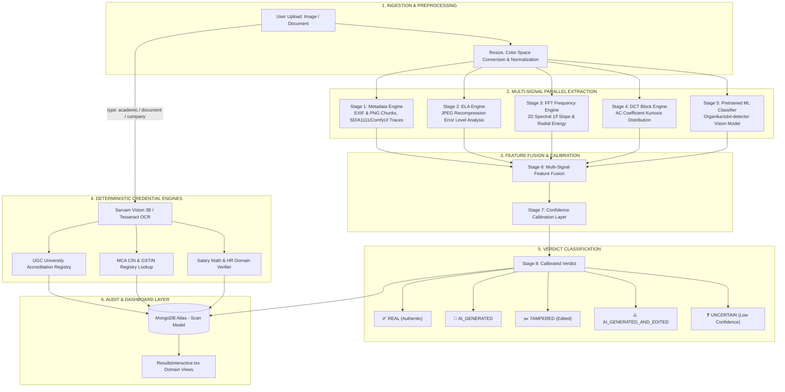

# 🏛️ TrustScan AI — System Architecture & Dataflow Specification

> **Version 4.2 — Multi-Modal Credential, Document & Multi-Signal AI Image Forensics**

This document outlines the production architecture of **TrustScan AI**, detailing how uploads (images, academic transcripts, corporate IDs, employment letters) flow through our multi-signal inspection engine, deep learning vision models, signal processing pipelines, and deterministic verification layers.

---

## 🗺️ High-Level System Architecture



---

## 🔬 Multi-Signal AI Image Forensics Architecture

Rather than relying on a single neural network or heuristic formula, TrustScan AI utilizes a **layered 8-stage multi-signal fusion pipeline**:

```
IMAGE
  │
  ▼
┌────────────────────────────────────────┐
│ Stage 0: Preprocessing & Normalization │
└──────────────────┬─────────────────────┘
                   │
  ┌────────────────┼──────────────────────────────┐
  │                │                              │
  ▼                ▼                              ▼
[METADATA]    [SIGNAL PROCESSING]            [LEARNED ML]
Stage 1:       Stage 2: ELA (Error Level)     Stage 5: Pretrained Classifier
EXIF / PNG     Stage 3: FFT (2D Frequency)    (Organika/sdxl-detector)
Prompt Traces  Stage 4: DCT (Block Kurtosis)  
  │                │                              │
  └────────────────┼──────────────────────────────┘
                   │
                   ▼
┌────────────────────────────────────────┐
│ Stage 6: Multi-Signal Feature Fusion   │
└──────────────────┬─────────────────────┘
                   │
                   ▼
┌────────────────────────────────────────┐
│ Stage 7: Confidence Calibration Layer  │
└──────────────────┬─────────────────────┘
                   │
                   ▼
┌────────────────────────────────────────┐
│ Stage 8: Calibrated Verdict Output     │
├────────────────────────────────────────┤
│ • REAL (Authentic)                     │
│ • AI_GENERATED                         │
│ • TAMPERED (Real Photo Edited)         │
│ • AI_GENERATED_AND_EDITED              │
│ • UNCERTAIN (Inconclusive Signal)      │
└────────────────────────────────────────┘
```

---

### Layer Breakdown

| Signal Layer | Component | Signal Target | Strengths & Role |
| :--- | :--- | :--- | :--- |
| **1. Metadata Signal** | `scan_exif_metadata` | PNG text chunks, EXIF tags, A1111/ComfyUI/Midjourney parameters | Ground-truth direct evidence when raw metadata survives web upload. |
| **2. Signal Processing (ELA)** | `analyze_ela` | JPEG recompression error levels, pixel brightness variance | Detects Photoshop, Canva, spliced regions, copy-paste cloning. |
| **3. Signal Processing (FFT)** | `analyze_frequency_domain` | 2D Fourier power spectrum, 1/f radial slope, high-frequency energy ratio | Identifies structural frequency anomalies and VAE grid upsampling artifacts. |
| **4. Signal Processing (DCT)** | `analyze_dct_uniformity` | 8x8 block discrete cosine transform AC coefficient kurtosis | Measures statistical distribution differences (Laplacian vs Gaussian). |
| **5. Learned ML Model** | `predict_sdxl_detector` | `Organika/sdxl-detector` Vision Transformer / CNN | Deep multi-scale latent feature classifier fine-tuned on diffusion image pairs. |
| **6. Deterministic Engines** | `rulesEngine.js` | UGC Registry, MCA CIN, GSTIN, Salary math, HR email domains | 100% deterministic mathematical & official database verification. |

---

## 📊 AI Detection Performance & Validation Metrics

### Pretrained Vision Model Specification
- **Model**: [`Organika/sdxl-detector`](https://huggingface.co/Organika/sdxl-detector)
- **Base Architecture**: Deep Image Classifier
- **Primary Strength**: High sensitivity to SDXL and modern latent diffusion imagery.
- **Reported Validation Metrics** *(Source: Model Card Validation Dataset)*:
  - **Accuracy**: `98.13%`
  - **F1 Score**: `97.33%`
  - **Precision**: `99.45%`
  - **Recall**: `95.29%`
  - **AUC**: `99.80%`
- **Known Limitations**: Performance is specialized for SDXL/latent diffusion architectures; cross-generator performance on other models (Midjourney, DALL-E, FLUX, GANs) may exhibit domain variance and is reinforced by TrustScan's multi-signal fusion layer.
- **Licensing**: CC-BY-NC-3.0 (Personal, educational, and research evaluation use).

---

## 📁 Key File Map & Responsibilities

| File Path | Role & Technology |
| :--- | :--- |
| [`client/src/app/scan-interface/components/ScanInterfaceInteractive.tsx`](file:///d:/Chakra/Code/CheckIt/client/src/app/scan-interface/components/ScanInterfaceInteractive.tsx) | 4-Portal scanner frontend with file validation and type dispatching |
| [`client/src/app/results-dashboard/components/ResultsInteractive.tsx`](file:///d:/Chakra/Code/CheckIt/client/src/app/results-dashboard/components/ResultsInteractive.tsx) | Domain-specific dashboard router rendering dedicated cards per scan type |
| [`server/routes/scan.js`](file:///d:/Chakra/Code/CheckIt/server/routes/scan.js) | Central ingestion route executing OCR, forensics, rules, and MongoDB persistence |
| [`server/services/analysis/imageForensicsService.js`](file:///d:/Chakra/Code/CheckIt/server/services/analysis/imageForensicsService.js) | Node.js bridge to Python multi-stage forensic analysis |
| [`server/scripts/sdxl_detector.py`](file:///d:/Chakra/Code/CheckIt/server/scripts/sdxl_detector.py) | Hugging Face `Organika/sdxl-detector` vision classifier execution wrapper |
| [`server/scripts/image_forensics.py`](file:///d:/Chakra/Code/CheckIt/server/scripts/image_forensics.py) | Complete 8-stage image forensics pipeline (FFT, ELA, EXIF, DCT, ML model, calibration) |
| [`server/models/Scan.js`](file:///d:/Chakra/Code/CheckIt/server/models/Scan.js) | Mongoose schema with multi-modal enum validation and threat signals |

---

## 🧪 Comprehensive Benchmarking Plan

To rigorously measure TrustScan AI's empirical accuracy across diverse generator families, the following benchmark test matrix is established:

```
BENCHMARK TEST MATRIX
├── REAL
│   ├── DSLR & Smartphone Photos (Natural Sensor Noise)
│   ├── Screenshots & Digital UI Captures
│   ├── Scanned Documents & Transcripts
│   └── Compressed Web Images (WhatsApp / Social Media)
├── AI GENERATED
│   ├── Stable Diffusion (SD 1.5 / SD 2.1)
│   ├── SDXL (1024x1024 Base + Refiner)
│   ├── Midjourney (v5 / v6)
│   ├── DALL-E (DALL-E 2 / DALL-E 3)
│   └── FLUX.1 (Schnell / Dev)
└── TAMPERED / COMPOSITE
    ├── Photoshop Clone / Splicing
    ├── Canva Text & Graphic Overlays
    ├── Document Stamp / Signature Alterations
    └── AI Generation + Photoshop Composite
```
