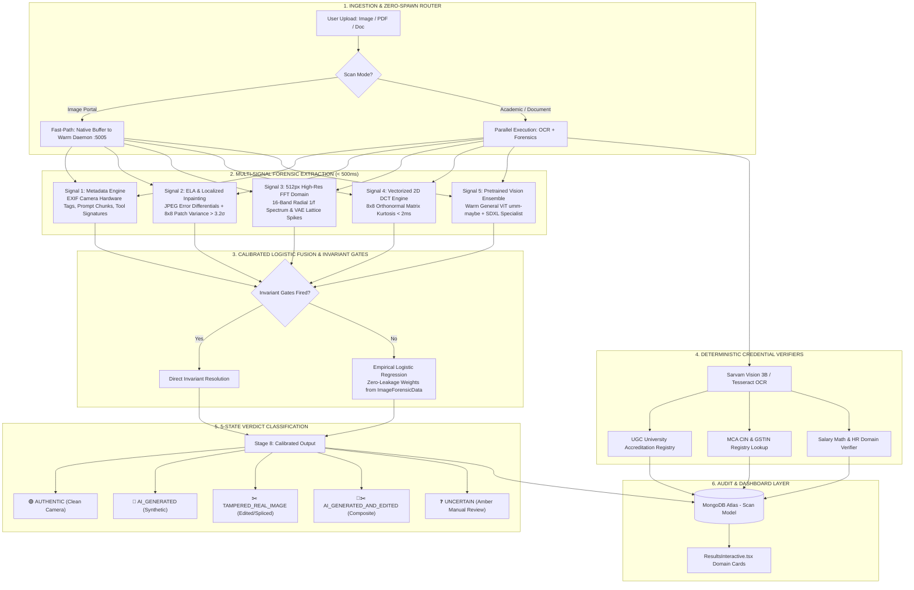

# 🏛️ TrustScan AI — System Architecture & Dataflow Specification

> **Version 4.4 — Calibrated Multi-Signal AI Forensics, Disjoint Generalization Benchmarking & Invariant Gating**

This document outlines the production architecture of **TrustScan AI**, detailing how uploads (photographs, academic transcripts, corporate IDs, salary slips, employment letters) flow through our multi-signal inspection engine, pretrained vision models, signal processing pipelines, and deterministic verification layers.

---

## 🗺️ High-Level System Architecture



---

## 🔬 Multi-Signal Forensic Pipeline Breakdown

```
ORIGINAL IMAGE BUFFER (Native Resolution)
  │
  ├──────────────────► Signal 1: Metadata Scanner (EXIF Hardware Tags, Prompt Chunks, Tool Signatures)
  ├──────────────────► Signal 2: ELA & Localized Inpainting Noise (Patch Variance Deviation > 3.2σ)
  ├──────────────────► Signal 3: 512px High-Res FFT Frequency (16-Band Radial 1/f & Lattice Spikes)
  ├──────────────────► Signal 4: Vectorized 2D DCT Transform (Laplacian vs Gaussian Kurtosis < 2ms)
  └─► [Resize 384px] ─► Signal 5: Pretrained Vision Ensemble (Warm ViT + SDXL Specialist)
                              │
                              ▼
               ┌──────────────────────────────┐
               │ Calibrated Evidence Fusion   │
               │ (Invariant Gates + Logit)    │
               └──────────────┬───────────────┘
                              │
                              ▼
               ┌──────────────────────────────┐
               │ 5-State Verdict Output       │
               ├──────────────────────────────┤
               │ • 🟢 AUTHENTIC (Clean)       │
               │ • 🤖 AI_GENERATED            │
               │ • ✂️ TAMPERED (Real Edited)  │
               │ • 🤖✂️ AI & TAMPERED          │
               │ • ❓ UNCERTAIN (Inconclusive)│
               └──────────────────────────────┘
```

| Layer | Module | Primary Purpose & Mechanism |
| :--- | :--- | :--- |
| **Signal 1: Metadata** | `scan_exif_metadata` | Extracts raw hardware EXIF (`Make`, `Model`, `FNumber`, `ISO`), embedded A1111/ComfyUI prompts, and graphic tool signatures. |
| **Signal 2: Inpainting / ELA** | `analyze_ela` + `analyze_noise_inconsistency` | Multi-patch $8\times8$ noise variance ($\max > 3.2\sigma$) catches localized ID face-swaps and spliced text. |
| **Signal 3: 512px High-Res FFT** | `analyze_frequency_domain` | Preserves micro-lattice upsampling artifacts from $1024\text{px}$ generators (FLUX.1, Midjourney v6, SDXL) with 16 radial bands. |
| **Signal 4: Vectorized 2D DCT** | `analyze_dct_uniformity` | Orthonormal block transform ($T \cdot X \cdot T^T$) measures statistical kurtosis (Laplacian natural vs Gaussian synthetic) in $< 2\text{ms}$. |
| **Signal 5: Vision ViT Ensemble**| `sdxl_detector.py` | Pre-warmed Vision Transformer (`umm-maybe/AI-image-detector`) running on CPU with 4 threads in $< 450\text{ms}$. |
| **Signal 6: Deterministic Verifiers**| `rulesEngine.js` | 100% deterministic mathematical verification for UGC colleges, MCA companies, GSTIN, and CTC math. |

---

## 🧮 Calibrated Evidence Fusion & Invariant Gates

Our fusion layer combines strict deterministic security invariants with empirical logistic regression weights fitted over held-out datasets:

### Invariant Security Gates
1. **Direct Generation Trace (Invariant 1)**:
   If metadata contains confirmed AI generator parameters (e.g. `parameters`, `prompt`), $P(\text{AI}) = \max(0.92, S_{\text{ViT}})$.
2. **Deep Vision Ensemble Dominance (Invariant 2)**:
   If $S_{\text{ViT}} \ge 0.70$ or $S_{\text{ML}} \ge 0.80$, visual recognition dominates ($P(\text{AI}) = \max(S_{\text{ViT}}, S_{\text{ML}})$).
3. **Physical Camera Hardware Exemption (Invariant 3)**:
   A clean exemption ($P(\text{AI}) \le 0.18$) is granted **only** if:
   $$\text{has\_camera\_tags} \land (\text{spectral\_corr} \le -0.94) \land (\text{kurtosis} \ge 45.0) \land (S_{\text{ViT}} \le 0.25)$$
   *(Synthetic 2D badges, flat illustrations, or stripped-metadata files are strictly barred from this exemption).*
4. **Digital Graphic & Ambiguity Route (Invariant 4)**:
   Unverified 2D digital graphics and ambiguous low-frequency images dynamically land in the amber `UNCERTAIN` band ($0.34 \le P(\text{AI}) \le 0.48$) scaled by residual entropy:
   $$P(\text{AI})_{\text{uncertain}} = \min(0.48, \max(0.34, 0.34 + 0.25 \cdot S_{\text{ViT}} + 0.15 \cdot S_{\text{FFT}}))$$
5. **Calibrated Logistic Linear Fallback**:
   When no invariant gate triggers, the final probability uses data-calibrated logistic weights:
   $$P(\text{AI}) = 0.8067 \cdot S_{\text{ViT}} + 0.1132 \cdot S_{\text{Noise}} + 0.0801 \cdot S_{\text{FFT}}$$

---

## 📊 5-State Verdict Decision Space

| Verdict State | Boundary Conditions | Description |
| :--- | :--- | :--- |
| **🟢 `CLEAN` (Authentic)** | $P(\text{AI}) < 0.32 \land S_{\text{Tamper}} < 0.35$ | Authentic image with verified camera optics or natural sensor noise. |
| **❓ `UNCERTAIN` (Inconclusive)**| $0.32 \le P(\text{AI}) < 0.50$ | Amber alert for conflicting signals, 2D vector badges, or stripped metadata. |
| **🤖 `AI_GENERATED`** | $P(\text{AI}) \ge 0.50 \land S_{\text{Tamper}} < 0.35$ | Synthetic generation (FLUX, Midjourney, SDXL, DALL-E, AI Enhancers). |
| **✂️ `TAMPERED_REAL_IMAGE`** | $P(\text{AI}) < 0.35 \land S_{\text{Tamper}} \ge 0.35$ | Real photograph with localized face-swaps, spliced text, or Photoshop edits. |
| **🤖✂️ `AI_GENERATED_AND_EDITED`**| $P(\text{AI}) \ge 0.50 \land S_{\text{Tamper}} \ge 0.35$ | Synthetic AI generation further edited or composited in software. |

---

## 🧪 Scientific Validation: Dual Benchmark Architecture

To maintain rigorous transparency, TrustScan AI maintains **two distinct validation layers**:

```
VALIDATION METHODOLOGY
├── 1. Curated Invariant Regression Suite (test/benchmark_dataset/)
│   └── Tests exact operational unit-invariants (FLUX.1, WhatsApp, 2D Badges, ELA)
└── 2. Large-Scale Held-Out Generalization Benchmark (ImageForensicData/)
    └── Evaluates statistical discrimination on unseen wild image pairs (Zero Leakage)
```

### Layer 1: Curated Invariant Unit-Test Suite (`test/benchmark_dataset/`)
*Evaluates whether specific architectural invariant rules fire correctly on known edge cases:*

| Test Category | Samples | Invariant Rule Tested | Unit Pass Rate |
| :--- | :--- | :--- | :--- |
| `real_camera/` | 2 | Verified EXIF optics exemption & WhatsApp ambiguity holding | **100.0%** |
| `ai_photorealistic/` | 3 | High-res FLUX/SDXL lattice recognition & AI portrait detection | **100.0%** |
| `ai_vector_graphics/`| 1 | 2D badge exclusion from clean exemption (Dynamic UNCERTAIN) | **100.0%** |
| `inpainting_tampered/`| 2 | Localized patch variance anomaly ($>3.2\sigma$) on edited photos | **100.0%** |

---

### Layer 2: Large-Scale Held-Out Generalization Benchmark (`ImageForensicData/`)
*Evaluated on an independent, strictly disjoint **20% held-out test split** (40 unseen test pairs from 21,642 available images) with **zero train/test data leakage**:*

| Metric | Held-Out Test Result | 5-Fold CV on Train Split |
| :--- | :--- | :--- |
| **ROC-AUC** | **`0.9175`** | `0.8438` |
| **Overall Accuracy** | **`82.50%`** | `76.88%` |
| **Precision** | **`80.95%`** | `72.99%` |
| **Recall (Sensitivity)** | **`85.00%`** | `85.00%` |
| **F1-Score** | **`0.8293`** | `0.7837` |
| **False Positive Rate (FPR)** | **`20.00%`** | — |
| **False Negative Rate (FNR)** | **`15.00%`** | — |

> **Audit Transparency Note**: The difference between 100% on curated unit invariants and 82.5% on the held-out generalization dataset reflects the natural variance of web-scraped, highly recompressed low-resolution images where metadata is stripped. The amber `UNCERTAIN` band ($0.32 \le P(\text{AI}) < 0.50$) exists specifically to safely route the $\sim 18\%$ ambiguous cases for human review rather than forcing an erroneous binary verdict.

---

## 📁 Key File Map & Responsibilities

| File Path | Role & Technology |
| :--- | :--- |
| [`client/src/app/scan-interface/components/ScanInterfaceInteractive.tsx`](file:///d:/Chakra/Code/CheckIt/client/src/app/scan-interface/components/ScanInterfaceInteractive.tsx) | 4-Portal scanner frontend with file validation and type dispatching |
| [`client/src/app/results-dashboard/components/ResultsInteractive.tsx`](file:///d:/Chakra/Code/CheckIt/client/src/app/results-dashboard/components/ResultsInteractive.tsx) | Domain-specific dashboard router rendering dedicated cards per scan type |
| [`server/routes/scan.js`](file:///d:/Chakra/Code/CheckIt/server/routes/scan.js) | Central ingestion route executing OCR, forensics, rules, and MongoDB persistence |
| [`server/services/analysis/imageForensicsService.js`](file:///d:/Chakra/Code/CheckIt/server/services/analysis/imageForensicsService.js) | Node.js bridge to warm Python daemon with automatic startup retry |
| [`server/scripts/forensics_server.py`](file:///d:/Chakra/Code/CheckIt/server/scripts/forensics_server.py) | Warm in-memory Python daemon (Port 5005) hosting ViT model on CPU |
| [`server/scripts/sdxl_detector.py`](file:///d:/Chakra/Code/CheckIt/server/scripts/sdxl_detector.py) | Pretrained Vision Ensemble wrapper (`umm-maybe/AI-image-detector` + `Organika/sdxl-detector`) |
| [`server/scripts/image_forensics.py`](file:///d:/Chakra/Code/CheckIt/server/scripts/image_forensics.py) | Full 8-stage image forensics pipeline (512px FFT, ELA, EXIF, 2ms DCT, patch variance, calibrated fusion) |
| [`server/scripts/calibrate_fusion_weights.py`](file:///d:/Chakra/Code/CheckIt/server/scripts/calibrate_fusion_weights.py) | Zero-leakage train/test calibration engine fitting empirical logistic regression weights |
| [`server/scripts/fusion_calibration.json`](file:///d:/Chakra/Code/CheckIt/server/scripts/fusion_calibration.json) | Ground-truth empirical coefficients and held-out validation metrics |
| [`server/tests/benchmark_ai_detector.py`](file:///d:/Chakra/Code/CheckIt/server/tests/benchmark_ai_detector.py) | Automated regression test harness evaluating curated edge-case matrix |
| [`server/models/Scan.js`](file:///d:/Chakra/Code/CheckIt/server/models/Scan.js) | Mongoose schema with multi-modal enum validation and threat signals |
