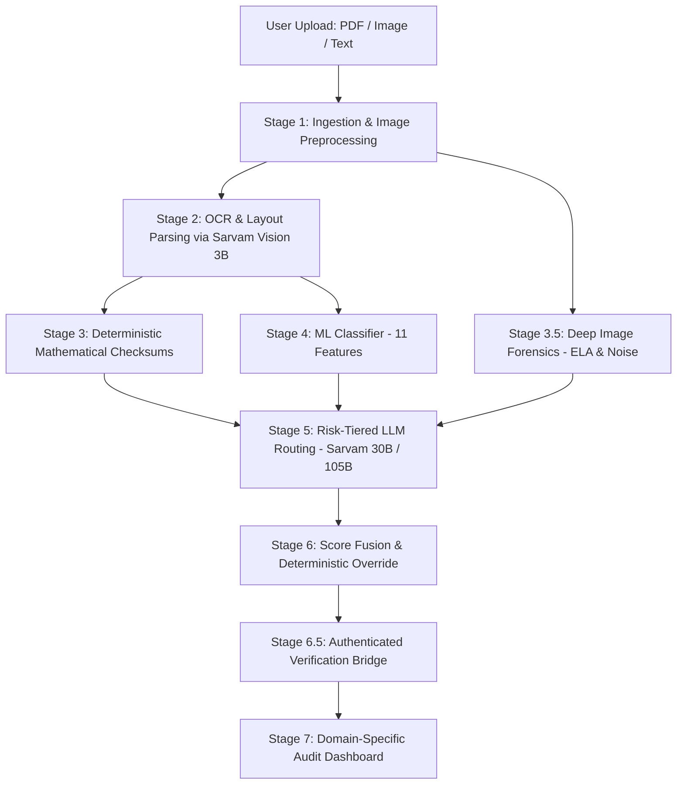

# 🏛️ TrustScan AI — System Architecture & Dataflow Specification

> **A Comprehensive Guide to the 7-Stage Multi-Modal Document & Fraud Verification Pipeline.**

Welcome to the internal engineering architecture of **TrustScan AI**. This document is designed for developers, contributors, and researchers who want a deep, sequential understanding of how documents, government IDs, corporate records, and payment receipts move through our verification pipeline.

---

## 🗺️ High-Level System Architecture



---

## 📁 Codebase Directory Structure & File Map

```
TrustScan/
├── client/                               # Next.js 16 + React 19 Frontend
│   ├── src/app/
│   │   ├── scan-interface/              # 4-Portal Scanner UI (Govt ID, Company, Career, UPI)
│   │   │   └── components/
│   │   │       ├── ScanInterfaceInteractive.tsx
│   │   │       └── FileUploadArea.tsx
│   │   ├── results-dashboard/           # Domain-Specific Result Dashboards
│   │   │   └── components/
│   │   │       ├── GovIdVerificationCard.tsx    # Aadhaar/PAN Checksum & ELA Card
│   │   │       ├── PaymentReceiptCard.tsx      # UPI UTR & Fake APK Splicing Card
│   │   │       ├── CareerDocumentCard.tsx      # CTC Math & Offer Letter Card
│   │   │       └── BusinessVerificationCard.tsx# MCA CIN & GSTIN Registry Card
│   │   ├── company-report/              # Live MCA Company Master Data Viewer
│   │   └── admin/                       # Admin Analytics & Telemetry Dashboard
│   └── src/api/                         # Client REST API wrappers
│
├── server/                               # Node.js + Express + Python Microservices
│   ├── routes/
│   │   └── scan.js                      # Core /api/scan Ingestion Endpoint
│   ├── services/
│   │   ├── processing/
│   │   │   ├── documentPipeline.js      # Multi-page PDF/Image Preprocessor
│   │   │   ├── ocrProcessor.js          # Hybrid OCR Coordinator
│   │   │   └── reportGenerator.js       # Human-readable TrustScan Report Builder
│   │   ├── analysis/
│   │   │   ├── sarvamService.js         # Sarvam Vision 3B OCR & Risk-Tiered LLM (30B/105B)
│   │   │   ├── imageForensicsService.js # Node.js wrapper for Python Forensics
│   │   │   ├── cardVisualInspector.js   # Roboflow Aadhaar/PAN Visual Landmark Auditor
│   │   │   └── aiReasoningService.js    # AI Explanation & Gemini/Sarvam Fallbacks
│   │   ├── engine/
│   │   │   ├── rulesEngine.js           # Multi-layered prosecution vs defense scorer
│   │   │   └── recommendationEngine.js  # Actionable security recommendations
│   │   └── verification/
│   │       └── verificationBridge.js    # Ground-truth adapters for MCA, GSTIN, and IFSC
│   └── scripts/
│       ├── image_forensics.py           # OpenCV/PIL ELA, Noise Inconsistency, and EXIF analyzer
│       ├── train_document_rules.py      # Logistic Regression ML model for document anomalies
│       └── download_indian_card_datasets.py # Roboflow Aadhaar & PAN dataset downloader
│
├── data/kaggle/                          # Benchmark & Training Datasets
└── docs/images/                          # Architectural Diagrams & Visual Assets
```

---

## ⚡ The 7-Stage Verification Pipeline (Step-by-Step)

### 🔹 Stage 1: Document Ingestion & Preprocessing
* **File:** [`server/services/processing/documentPipeline.js`](file:///d:/Chakra/Code/CheckIt/server/services/processing/documentPipeline.js)
* **What Happens:** Uploaded files (PDFs, JPEGs, PNGs) undergo resolution enhancement, aspect ratio validation, and adaptive page splitting. Image PDFs are rendered at 2.0x scale via `PyMuPDF` for crystal-clear character boundaries.

### 🔹 Stage 2: OCR & Layout Digitization
* **File:** [`server/services/analysis/sarvamService.js`](file:///d:/Chakra/Code/CheckIt/server/services/analysis/sarvamService.js)
* **Model:** **Sarvam Vision (3B VLM)**
* **Capabilities:** Digitizes 23 Indian languages with layout tags (Markdown tables, key-value headers, and bounding boxes).

### 🔹 Stage 3: Deterministic Mathematical Checksums
* **Rules Implemented:**
  1. **Aadhaar Verhoeff Algorithm:** Validates 12-digit UID numbers using the Dihedral Group $D_5$ multiplication table ($d$) and permutation table ($p$).
  2. **PAN Entity Structure:** Audits the 4th character (`P` = Individual, `C` = Company, `F` = Firm, `H` = HUF, `T` = Trust).
  3. **GSTIN State Code Mapping:** Verifies 2-digit state prefixes (`27` = MH, `07` = DL, `29` = KA) and cross-checks characters 3–12 against the embedded PAN.
  4. **MCA 21-Digit CIN:** Parses Corporate Identity Numbers into Industry classification, State of registration, Incorporation year, Ownership class (`PTC`/`PLC`), and RoC registration.
  5. **Salary & Invoice Arithmetic:** Checks `Gross = Base + HRA + Allowances - Deductions`.

### 🔹 Stage 3.5: Deep Image Forensics Engine
* **File:** [`server/scripts/image_forensics.py`](file:///d:/Chakra/Code/CheckIt/server/scripts/image_forensics.py)
* **Analysis Performed:**
  - **Error Level Analysis (ELA):** Resaves images at 90% JPEG compression and measures pixel variance. Edited text or spliced amounts appear with high error variance.
  - **Noise Inconsistency:** Measures Laplacian high-pass variance across local $32 \times 32$ image patches.
  - **EXIF / Software Signatures:** Scans metadata streams for Photoshop, Canva, GIMP, Acrobat, and Midjourney traces.

### 🔹 Stage 4: ML Document Classifier
* **File:** [`server/scripts/train_document_rules.py`](file:///d:/Chakra/Code/CheckIt/server/scripts/train_document_rules.py)
* **Model:** Trained Logistic Regression classifier on 11 weighted document features ($100\%$ fraud recall on adversarial datasets).

### 🔹 Stage 5: Risk-Tiered LLM Routing
* **File:** [`server/services/analysis/sarvamService.js`](file:///d:/Chakra/Code/CheckIt/server/services/analysis/sarvamService.js)
* **Routing Logic:**
  - 🟢 **Low-Risk ($p < 0.3$)** $\rightarrow$ `sarvam-30b` (Fast, cost-effective structured extraction).
  - 🔴 **High-Risk ($p \ge 0.3$ or checksum failure)** $\rightarrow$ `sarvam-105b` (Deep hybrid step-by-step reasoning).

### 🔹 Stage 6: Multi-Modal Score Fusion Formula
$$\text{FinalTrustScore} = 
\begin{cases} 
\le 10\% \text{ (FORCED HIGH RISK)}, & \text{if any deterministic math or checksum rule fails} \\
(0.40 \times \text{ML\_Score} + 0.60 \times \text{LLM\_Score}) \times 100, & \text{otherwise}
\end{cases}$$

### 🔹 Stage 6.5: Authenticated Verification Bridge
* **File:** [`server/services/verification/verificationBridge.js`](file:///d:/Chakra/Code/CheckIt/server/services/verification/verificationBridge.js)
* Non-blocking ground-truth adapters for **MCA Master Data (CIN)**, **GST Search API**, and **RBI IFSC Bank Directory**.

---

## 🔒 Security & Privacy First
- **Zero PII Retention:** Sensitive government IDs (Aadhaar/PAN) are processed strictly in-memory and wiped immediately after inference.
- **Client-Side Sanitization:** Masked Aadhaar formats (`XXXX XXXX 1234`) are enforced across logs and responses.
