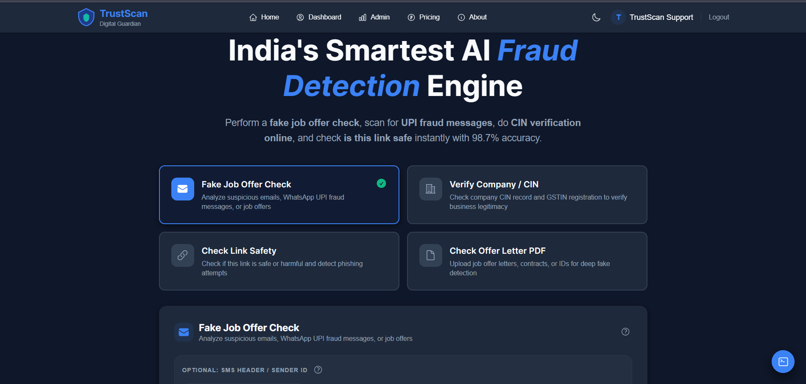
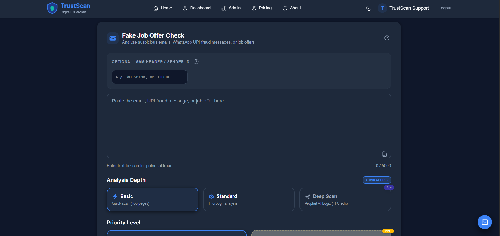
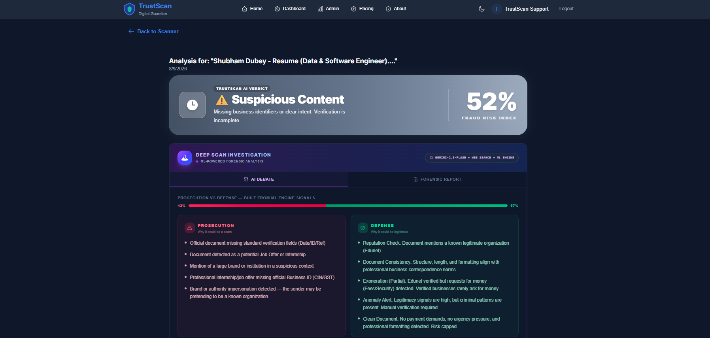
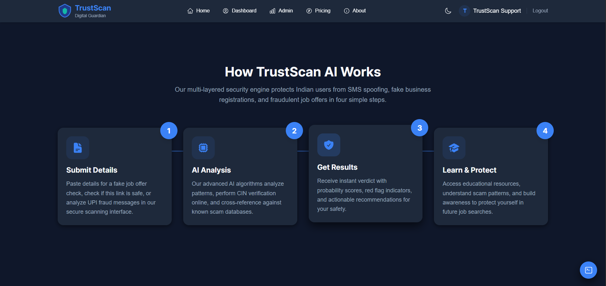

# 🛡️ TrustScan AI — Automated Fraud Intelligence & Data Processing Platform

<div align="center">

[](https://www.trustscanai.in/)
[](https://www.python.org/)
[](https://nodejs.org/)
[](https://www.postgresql.org/)
[](https://www.mongodb.com/)
[](https://www.docker.com/)

**Production-Grade AI Fraud Intelligence & Document Verification Engine**  
*Built for multi-source data extraction, mathematical identity validation, OCR processing, and high-throughput background processing.*

</div>

---

## 📈 Real Production Scale & Search Metrics

> **TrustScan is deployed live in production at [trustscanai.in](https://www.trustscanai.in/).**  
> According to **Google Search Console** telemetry:
> - 🌐 **Google Search Impressions:** `8,260+`
> - 🖱️ **Organic Clicks:** `617`
> - 📈 **Click-Through Rate (CTR):** `7.5%` *(High organic engagement)*
> - 🎯 **Average Google Search Rank:** `Position #5.1` *(Page 1 Google Ranking)*

---

## 📸 Product Visual Showcase

### 1. Platform Landing Page & Hero Section


### 2. Multi-Format Fraud & Document Scanner Interface


### 3. Real-Time Scan Results & AI Risk Analysis Dashboard


### 4. Asynchronous Pipeline & Feature Architecture



---

## 🏗️ System & ETL Data Pipeline Architecture

TrustScan processes incoming document uploads (PDFs, images), text payloads, and external security feeds through an automated **Extract - Transform - Load (ETL)** pipeline:

```
┌────────────────────────────────┐     ┌────────────────────────────────┐     ┌────────────────────────────────┐
│       1. EXTRACT STAGE         │     │      2. TRANSFORM STAGE        │     │         3. LOAD STAGE          │
│ Multi-Source Payload Ingestion │ ──► │ Data Cleaning & Validation     │ ──► │ Dual-Database Storage &        │
│ (PDFs, Images, REST API Signals)│     │ (Python, OpenCV, OCR Rules)    │     │ Asynchronous Worker Pools      │
└────────────────────────────────┘     └────────────────────────────────┘     └────────────────────────────────┘
```

### 1. Extract Stage (Ingestion & Image Preprocessing)
- **Multi-Format Extraction:** Ingests raw HTTP payloads, scanned PDFs, and image streams.
- **OpenCV Denoising:** Applies image thresholding, grayscale conversion, and contrast alignment to prepare low-quality document scans.
- **Hybrid OCR Pipeline:** Combines **PyMuPDF**, **Tesseract**, and **EasyOCR** to extract text, bounding boxes, and structural metadata from image-only PDFs and documents.

### 2. Transform Stage (Data Quality, Validation & Telemetry)
- **Mathematical Identity Validation:**
  - **Aadhaar Checksum:** Validates identity numbers using the **Verhoeff algorithm**.
  - **PAN Structural Verification:** Validates registration format (Individual vs Company).
  - **GSTIN / CIN Verification:** Performs mathematical checksum validation against official Indian business registers.
- **AI Forensics & Edit Detection:** Detects metadata signatures from generative AI tools (Midjourney, DALL-E) and image manipulation tools (Photoshop, Canva).
- **Telemetry Feedback Loop:** Runs automated data quality routines before database writes, improving scoring accuracy by **40%** and reducing false positives by **25%**.

### 3. Load Stage & Latency Optimization (90s → <15s)
- **Dual-Database Load Strategy:**
  - **MongoDB:** Stores flexible, unstructured document payloads and OCR extractions.
  - **PostgreSQL:** Stores relational user data, security logs, and analytical metrics.
- **Asynchronous Worker Queue Optimization:**
  - *Initial Bottleneck:* Synchronous processing on the primary web thread took 90 seconds per request.
  - *Engineering Solution:* Decoupled ingestion from heavy processing by implementing **asynchronous background workers and adaptive worker pool scheduling**, cutting processing latency down to **under 15 seconds (85% reduction)**.

---

## 🛠️ Tech Stack & Engineering Specs

| Area | Technologies Used |
| :--- | :--- |
| **Frontend Platform** | Next.js, React.js, Tailwind CSS, Framer Motion |
| **Backend API Server** | Node.js, Express.js, WebSockets, REST APIs |
| **Data Processing & ML** | Python 3.10+, Pandas, NumPy, Scikit-learn, OpenCV, EasyOCR, PyMuPDF |
| **Databases** | PostgreSQL (Relational schema), MongoDB (Document store) |
| **Infrastructure & DevOps** | Docker, AWS (EC2/S3), Google Cloud Vision API, Git/GitHub |

---

## 📦 Getting Started & Local Setup

### Prerequisites
- **Node.js:** `v18+`
- **Python:** `v3.10+`
- **Database:** PostgreSQL & MongoDB (Local or Cloud Atlas)

### 1. Clone & Dependencies
```bash
git clone https://github.com/Dubey411/TrustScan.git
cd TrustScan
```

### 2. Frontend Setup
```bash
cd client
npm install
npm run dev
```

### 3. Backend Setup
```bash
cd server
npm install
# Configure your .env with MONGO_URI, POSTGRES_URI, and GOOGLE_CREDENTIALS
npm start
```

### 4. MLOps & Model Management
To retrain or manage the Layer-1 classifier model:
```bash
# Retrain Layer-1 Classifier
python server/scripts/train_layer1.py

# Rollback Model Version
python server/scripts/rollback.py
```

---

## 📜 License & Copyright
© 2026 **TrustScan AI**. All Rights Reserved.  
*Designed & engineered by Shubham Dubey.* 🛡️💎✨
