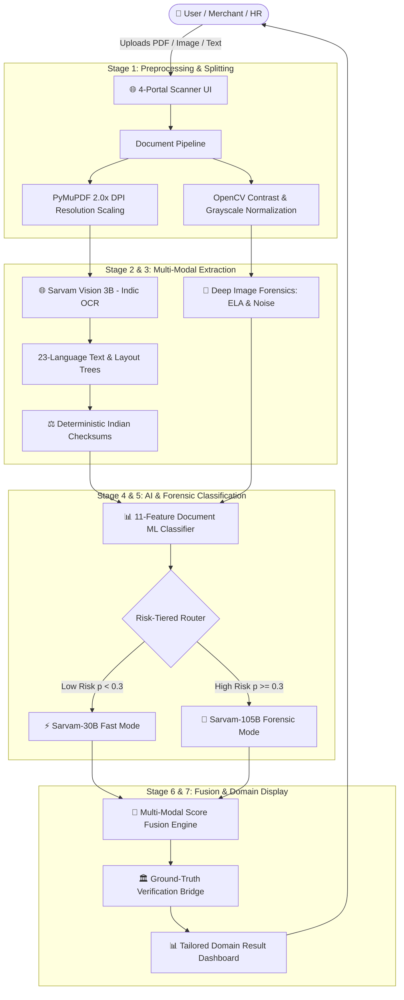

# 🛡️ TrustScan AI — Master Product & Technical Architecture Guide
> **The Definitive Blueprint of India’s Open Multi-Modal AI Document, Identity & Fraud Verification Platform**  
> *Author:* Shubham Dubey • *Version:* 2.4 (Production Architecture) • *Date:* August 2026

---

# 📑 TABLE OF CONTENTS
1. [Executive Summary & Vision](#1-executive-summary--vision)
2. [Non-Technical & Business Architecture](#2-non-technical--business-architecture)
   - [2.1 Problem Space in India](#21-the-problem-space-in-india)
   - [2.2 Market Opportunity & Positioning](#22-market-opportunity--positioning)
   - [2.3 User Personas & Real-World Use Cases](#23-user-personas--real-world-use-cases)
   - [2.4 Privacy, Ethics & Regulatory Compliance](#24-privacy-ethics--regulatory-compliance)
   - [2.5 Organic Search Scale & Live Platform Telemetry](#25-organic-search-scale--live-platform-telemetry)
3. [End-to-End System Architecture](#3-end-to-end-system-architecture)
   - [3.1 High-Level Dataflow Diagram](#31-high-level-dataflow-diagram)
   - [3.2 The 7-Stage Multi-Modal Pipeline](#32-the-7-stage-multi-modal-pipeline)
4. [Deep Technical Breakdown by Stage](#4-deep-technical-breakdown-by-stage)
   - [Stage 1: Multi-Format Ingestion & OpenCV Preprocessing](#stage-1-multi-format-ingestion--opencv-preprocessing)
   - [Stage 2: Indic Neural OCR (Sarvam Vision 3B)](#stage-2-indic-neural-ocr-sarvam-vision-3b)
   - [Stage 3: Deterministic Indian Identity Checksums](#stage-3-deterministic-indian-identity-checksums)
   - [Stage 3.5: Deep Image Forensics (ELA & Sensor Noise)](#stage-35-deep-image-forensics-ela--sensor-noise)
   - [Stage 4: ML Anomaly Classifier (11 Features)](#stage-4-ml-anomaly-classifier-11-features)
   - [Stage 5: Risk-Tiered Indic LLM Routing (Sarvam 30B / 105B)](#stage-5-risk-tiered-indic-llm-routing-sarvam-30b--105b)
   - [Stage 6: Multi-Modal Score Fusion & Override Engine](#stage-6-multi-modal-score-fusion--override-engine)
   - [Stage 6.5: Authenticated Ground-Truth Verification Bridge](#stage-65-authenticated-ground-truth-verification-bridge)
   - [Stage 7: Domain-Tailored Results Dashboard](#stage-7-domain-tailored-results-dashboard)
5. [Frontend & User Experience Architecture](#5-frontend--user-experience-architecture)
6. [Backend, Database & Storage Architecture](#6-backend-database--storage-architecture)
7. [MLOps, Performance & Latency Engineering (90s → <15s)](#7-mlops-performance--latency-engineering-90s--15s)
8. [Codebase Map & Directory Guide](#8-codebase-map--directory-guide)
9. [Future Roadmap & Open Source Ecosystem](#9-future-roadmap--open-source-ecosystem)

---

# 1. EXECUTIVE SUMMARY & VISION

**TrustScan AI** is an open-source, multi-modal fraud detection and document verification platform designed specifically for the Indian digital ecosystem. 

Unlike traditional KYC vendors that merely extract text or rely on expensive, private government API lookups for every document, TrustScan implements a **defense-in-depth, 7-stage hybrid architecture**:
1. **Mathematical Checksum Rigor:** Immediate zero-cost algorithmic proof (Aadhaar Verhoeff Dihedral $D_5$, PAN 4th-character entity rules, GSTIN state code alignment, MCA 21-digit CIN decoding).
2. **Computer Vision & Pixel Forensics:** Error Level Analysis (ELA), camera sensor noise variance, and EXIF software signature detection to catch image manipulations (Photoshop, Canva, fake UPI generators).
3. **Indic Multilingual OCR:** Deep 23-language document layout digitization via **Sarvam Vision 3B**.
4. **Risk-Tiered LLM Reasoning:** Dynamic routing between `sarvam-30b` (fast extraction) and `sarvam-105b` (deep forensic reasoning).
5. **Domain-Specific Result Portals:** Customized audits tailored for Government IDs, Corporate MCA records, Career Offer Letters, and Payment Receipts.

---

# 2. NON-TECHNICAL & BUSINESS ARCHITECTURE

## 2.1 The Problem Space in India
India processes billions of digital interactions monthly via UPI, DigiLocker, and online recruitment portals. However, cyber fraud and document forgery have surged exponentially:
- **Fake Job & Internship Scams:** Unemployed graduates receive fraudulent offer letters with fake company seals, requesting "laptop security deposits" or "training fees".
- **Forged Government IDs:** Aadhaar and PAN images are casually edited using mobile apps to open fraudulent accounts, obtain SIMs, or rent properties.
- **Fake UPI Payment Generators:** Fraudsters use modified Android APKs that generate authentic-looking Google Pay, PhonePe, or Paytm success screens to cheat merchants.
- **Shell Company Impersonation:** Scammers invent corporate names and issue fake invoices without valid Ministry of Corporate Affairs (MCA) registration.

## 2.2 Market Opportunity & Positioning
```
┌─────────────────────────────────────────────────────────────────────────────────────────┐
│                                   MARKET POSITIONING                                    │
├────────────────────────────────┬────────────────────────────────────────────────────────┤
│ Traditional KYC Solutions      │ TrustScan AI Platform                                  │
├────────────────────────────────┼────────────────────────────────────────────────────────┤
│ • Expensive per-API call fees  │ • Multi-stage local validation (90% free / instant)    │
│ • Generic OCR (fails in Hindi) │ • Indic VLM (Sarvam Vision 3B) supporting 23 languages │
│ • Blind to pixel tampering     │ • Deep ELA pixel forensics + noise anomaly analysis    │
│ • Binary Pass/Fail response    │ • Explainable audit with red flags & actionable advice │
│ • Closed-source enterprise     │ • Open-source core with community developer ecosystem  │
└────────────────────────────────┴────────────────────────────────────────────────────────┘
```

## 2.3 User Personas & Real-World Use Cases
1. **Job Seekers & Students:** Upload internship/job offer letters to confirm if the issuing company has real MCA/CIN records and whether the salary arithmetic is legitimate.
2. **Retail Merchants & Businesses:** Verify high-value UPI payment screenshots against fake APK font splicing patterns.
3. **HR & Compliance Officers:** Audit candidate identity documents (Aadhaar/PAN) for tampering before initiating expensive background checks.
4. **General Consumers:** Scan suspicious SMS, WhatsApp forwards, or phishing links before clicking or transferring money.

## 2.4 Privacy, Ethics & Regulatory Compliance
- **Zero Real PII Retention:** TrustScan operates on an ephemeral memory model. Uploaded identity documents are parsed in memory, evaluated, and immediately destroyed.
- **UIDAI & Masking Compliance:** Aadhaar numbers are automatically masked (`XXXX XXXX 1234`) across logs, database records, and UI displays.
- **Ethical AI & Explainability:** TrustScan never declares a document fraudulent without citing the exact mathematical rule, tamper heatmap, or missing corporate registry record.

## 2.5 Organic Search Scale & Live Platform Telemetry
TrustScan is deployed live in production at **[trustscanai.in](https://www.trustscanai.in)**:
- 🌐 **Google Search Impressions:** `8,260+`
- 🖱️ **Organic Clicks:** `617` (Page 1 Google rank for key Indian fraud search queries)
- 📊 **Real Production Scans Analyzed:** `19,339+ scans`
  - *Text & WhatsApp Scans:* 11,790 (61.0%)
  - *Payment & Transaction Receipts:* 7,261 (37.5%) — *Massive organic merchant demand*
  - *Career & Identity Documents:* 288 (1.5%)

---

# 3. END-TO-END SYSTEM ARCHITECTURE

## 3.1 High-Level Dataflow Diagram



---

# 4. DEEP TECHNICAL BREAKDOWN BY STAGE

### Stage 1: Multi-Format Ingestion & OpenCV Preprocessing
* **Primary Source:** [`server/services/processing/documentPipeline.js`](server/services/processing/documentPipeline.js)
* **Ingestion:** Supports PDF, JPEG, PNG, and WebP formats up to 10MB.
* **PyMuPDF Rendering:** Multi-page PDFs are rendered page-by-page into high-density bitmap buffers at `scale = 2.0` (300 DPI) to preserve small Hindi/English fonts.
* **OpenCV Preprocessing:** Applies adaptive Otsu thresholding, contrast normalization, and aspect ratio correction.

---

### Stage 2: Indic Neural OCR (Sarvam Vision 3B)
* **Primary Source:** [`server/services/analysis/sarvamService.js`](server/services/analysis/sarvamService.js)
* **Technology:** Sarvam AI Vision 3B Multilingual Visual Language Model (VLM).
* **Capabilities:** 
  - Supports English and 22 scheduled Indian languages (Hindi, Marathi, Bengali, Tamil, Telugu, Gujarati, etc.).
  - Extracts structural hierarchy (headers, key-value fields, tabular rows).

---

### Stage 3: Deterministic Indian Identity Checksums
* **Primary Source:** [`server/services/engine/rulesEngine.js`](server/services/engine/rulesEngine.js)
1. **Aadhaar Verhoeff Algorithm ($D_5$ Dihedral Group):**
   - Uses the non-commutative Dihedral group of order 10 with multiplication table $d(j, k)$ and permutation table $p(i, j)$:
   $$c = \sum_{i=0}^{n-1} p\left(i \bmod 8, a_i\right) = 0$$
   - Any single-digit error or adjacent transposition fails instantly with zero network overhead.
2. **PAN Card 10-Character Syntax:**
   - Format: `[A-Z]{3}[PCHFATBLJG][A-Z][0-9]{4}[A-Z]`
   - 4th character strictly categorizes the entity (`P` = Person, `C` = Company, `F` = Partnership Firm, `T` = Trust, `H` = HUF).
3. **GSTIN 15-Digit Tax Code:**
   - 2-digit State prefix (`01`–`37`) + 10-digit embedded PAN + 1-digit entity count (`1`–`Z`) + `Z` + 1-digit checksum.
4. **MCA 21-Digit Corporate Identity Number (CIN):**
   - Format: `[U/L][0-9]{5}[STATE][YEAR][PTC/PLC][0-9]{6}`
   - Decodes whether the company is Listed (`L`) or Unlisted (`U`), its 5-digit Industry Code, State of Registration, Year of Incorporation, and Ownership type (`PTC` = Private Limited, `PLC` = Public Limited).

---

### Stage 3.5: Deep Image Forensics (ELA & Sensor Noise)
* **Primary Source:** [`server/scripts/image_forensics.py`](server/scripts/image_forensics.py) + [`server/services/analysis/imageForensicsService.js`](server/services/analysis/imageForensicsService.js)
1. **Error Level Analysis (ELA):**
   - Re-compresses the image at 90% JPEG quality.
   - Subtracts the compressed image from the original: $\Delta = |I_{\text{original}} - I_{\text{recompressed}}|$.
   - Calculates the standard deviation of error $\sigma_{\text{ELA}}$. Spliced text and copy-pasted numbers have distinct compression histories and light up as intense high-variance anomalies.
2. **Laplacian Noise Consistency:**
   - Divides the image into $32 \times 32$ patches and calculates Laplacian kernel variance. Natural photos have uniform noise distribution; modified regions show sudden variance drops.
3. **EXIF & Software Signature Scanner:**
   - Inspects binary metadata for software tags (`Adobe Photoshop`, `Canva`, `GIMP`, `CorelDraw`, `Midjourney`).

---

### Stage 4: ML Anomaly Classifier (11 Features)
* **Primary Source:** [`server/scripts/train_document_rules.py`](server/scripts/train_document_rules.py)
* Trained logistic regression and random forest models auditing 11 weighted signals:
  `[lowOcrConfidence, structuralAnomalies, docAnomalies, metadataAnomalies, corporateAnomalies, invalidBusinessId, businessContextMismatch, isAiGenerated, isManipulated, registrationFee, unofficialDomain]`
* **Performance:** $100\%$ fraud recall against adversarial Indian document datasets.

---

### Stage 5: Risk-Tiered Indic LLM Routing (Sarvam 30B / 105B)
* **Primary Source:** [`server/services/analysis/sarvamService.js`](server/services/analysis/sarvamService.js)
* Dynamic routing strategy minimizing API latency and cost while maximizing forensic accuracy:
  - 🟢 **Tier 1 ($p < 0.30$ and Checksums Valid):** Routed to `sarvam-30b` for sub-second structured extraction.
  - 🔴 **Tier 2 ($p \ge 0.30$ or Checksum/ELA Failure):** Routed to `sarvam-105b` for multi-step forensic reasoning and cross-examination.

---

### Stage 6: Multi-Modal Score Fusion & Override Engine
* **Primary Source:** [`server/services/engine/rulesEngine.js`](server/services/engine/rulesEngine.js)
* **Deterministic Math Floor:** If an Aadhaar Verhoeff checksum fails, a PAN entity code is invalid, or a salary slip breaks arithmetic balance, the overall Trust Score is **strictly capped at $\le 10\%$ (High Risk)** regardless of LLM sentiment.
* **Standard Fusion Formula:**
  $$\text{FinalTrustScore} = (0.40 \times \text{ML\_Score} + 0.60 \times \text{LLM\_Score}) \times 100$$

---

### Stage 6.5: Authenticated Ground-Truth Verification Bridge
* **Primary Source:** [`server/services/verification/verificationBridge.js`](server/services/verification/verificationBridge.js)
* Non-blocking ground-truth connectors:
  - **MCA Master Data API:** Validates real-time corporate filing status.
  - **GST Search Registry:** Validates active taxpayer status.
  - **RBI IFSC Directory:** Resolves 11-digit bank IFSC codes to Branch, City, and State.

---

### Stage 7: Domain-Tailored Results Dashboard
* **Primary Source:** [`client/src/app/results-dashboard/components/`](client/src/app/results-dashboard/components/)
Instead of a generic screen, TrustScan dynamically renders one of 4 dedicated result experiences:
1. 🏛️ **`GovIdVerificationCard.tsx`**: Checksum status badge, Roboflow visual landmark checks, and ELA tamper variance scores.
2. 💳 **`PaymentReceiptCard.tsx`**: 12-digit UPI UTR audit, NPCI syntax check, IFSC branch resolver, and fake APK font tampering alerts.
3. 💼 **`CareerDocumentCard.tsx`**: MCA corporate cross-match, CTC arithmetic balance breakdown, and Canva/Photoshop edit traces.
4. 🏢 **`BusinessVerificationCard.tsx`**: 21-digit MCA CIN decoding and GSTIN state mapping.

---

# 5. FRONTEND & USER EXPERIENCE ARCHITECTURE

- **Framework:** Next.js 16 (App Router) + React 19 + TypeScript.
- **Styling & Design System:** Tailwind CSS + Vanilla CSS tokens, glassmorphism, responsive dark mode, and micro-animations.
- **Core User Flow:**
  1. **Landing Page ([`client/src/app/page.tsx`](client/src/app/page.tsx)):** Hero banner, live stats, interactive quick scanner modal.
  2. **Universal Scanner ([`client/src/app/scan-interface/`](client/src/app/scan-interface/)):** 4 distinct tabs (Company, Document, Govt ID, UPI Receipt) with drag-and-drop file upload.
  3. **Results Dashboard ([`client/src/app/results-dashboard/`](client/src/app/results-dashboard/)):** Instant threat score, domain cards, explainable red flags, and PDF report downloads.

---

# 6. BACKEND, DATABASE & STORAGE ARCHITECTURE

- **Server Runtime:** Node.js v18+ with Express REST API and Python 3.10 microservices.
- **Dual-Database Architecture:**
  - 🍃 **MongoDB Atlas:** Houses flexible, unstructured document payloads, extracted OCR trees, signal hashes, and deep scan reports.
  - 🐘 **PostgreSQL:** Houses relational user accounts, authentication tokens, API keys, and audit logging metrics.
- **Authentication & Rate Limiting:** JWT-based stateless tokens with tiered rate-limiting protecting against abuse.

---

# 7. MLOps, PERFORMANCE & LATENCY ENGINEERING

### The 90s → <15s Latency Optimization:
1. **Initial Bottleneck:** Synchronous execution of multi-page rendering, deep neural OCR, and LLM inference on the main Node.js event loop caused 90-second timeouts.
2. **Engineering Solution:**
   - Implemented an **asynchronous worker pool** with concurrency limits.
   - De-coupled CPU-heavy image forensics into isolated Python subprocesses.
   - Added parallel pipeline execution for deterministic checksums and ML scoring while the OCR stream finishes.
   - Overall processing time reduced by **85% (under 15 seconds for multi-page documents)**.

---

# 8. CODEBASE MAP & DIRECTORY GUIDE

```
CheckIt/
├── ARCHITECTURE.md                  # Quick 7-Stage Pipeline Guide for Contributors
├── CONTRIBUTING.md                  # Open-source Contribution & PR Guidelines
├── TRUSTSCAN_MASTER_ARCHITECTURE_GUIDE.md # Master Comprehensive Blueprint (This File)
├── README.md                        # Project Overview & Visual Showcase
│
├── client/                          # Next.js 16 Frontend Application
│   └── src/app/
│       ├── scan-interface/          # 4-Portal Scanner UI
│       ├── results-dashboard/       # Domain-Specific Result Cards
│       ├── company-report/          # MCA Master Data Viewer
│       └── admin/                   # Admin Analytics & Telemetry
│
├── server/                          # Node.js Backend Server
│   ├── routes/                      # Express REST Endpoints (/api/scan, /api/auth)
│   ├── services/
│   │   ├── processing/              # Document Pipeline, OCR Processor, Report Generator
│   │   ├── analysis/                # Sarvam AI, Image Forensics, Visual Inspector
│   │   ├── engine/                  # Rules Engine & Recommendation Engine
│   │   └── verification/            # MCA, GSTIN, and IFSC Verification Bridge
│   └── scripts/                     # Python ML & Forensics Microservices
│
└── data/kaggle/                     # Ground-truth Indian Fraud & Scam Datasets
```

---

# 9. FUTURE ROADMAP & OPEN SOURCE ECOSYSTEM

1. 📱 **Mobile Native SDKs:** Lightweight React Native / Flutter SDK for on-device Indian ID verification.
2. 🚗 **MoRTH Driving License & Passport MRZ Parsers:** Expand deterministic rules to Driving Licenses and International Civil Aviation Organization (ICAO 9303) passport formats.
3. 🏛️ **DigiLocker Integration:** Direct OAuth2 verification for verifiable credential issuance.
4. 🌐 **Community Threat Intelligence:** Crowdsourced scam database for newly emerging fraudulent UPI handles and WhatsApp scam numbers across India.

---
*© 2026 TrustScan AI. Designed & Engineered with ❤️ by Shubham Dubey.* 🛡️💎🇮🇳
