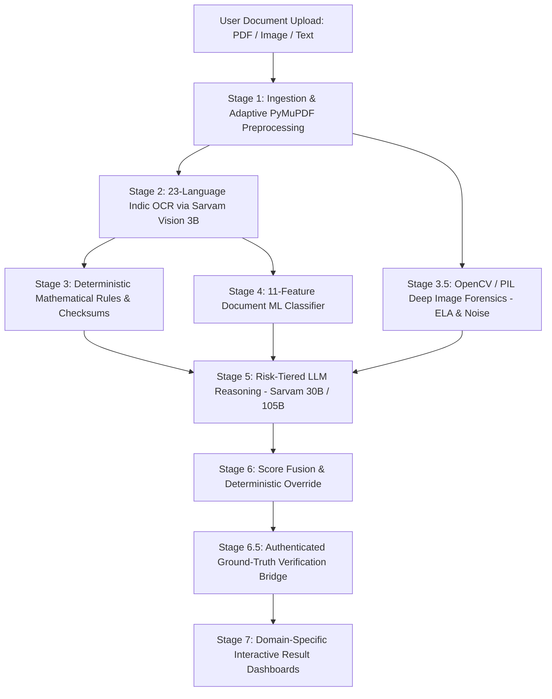

# 🛡️ TrustScan AI — Master Architecture & Operations Guide

> **A Complete Strategic & Technical Engineering Specification for TrustScan AI.**

---

# 🌐 PART 1: Non-Technical & Business Aspects

```
                                  ┌─────────────────────────────────────────┐
                                  │      THE INDIAN FRAUD EPIDEMIC          │
                                  │ 1. Fake Internship & Job Offer Letters  │
                                  │ 2. Forged Aadhaar / PAN Identity Cards  │
                                  │ 3. Fake UPI Transaction Screenshots     │
                                  │ 4. Unregistered MCA Shell Companies     │
                                  └────────────────────┬────────────────────┘
                                                       │
                                                       ▼
                                  ┌─────────────────────────────────────────┐
                                  │             TRUSTSCAN AI                │
                                  │   Multi-Modal Verification Engine       │
                                  └────────────────────┬────────────────────┘
                                                       │
                 ┌──────────────────┬──────────────────┴──────────────────┬──────────────────┐
                 ▼                  ▼                                     ▼                  ▼
        ┌──────────────────┐┌──────────────────┐                 ┌──────────────────┐┌──────────────────┐
        │ 🏢 COMPANY & CIN ││ 🏛️ GOVT ID AUDIT │                 │ 💼 CAREER DOCS   ││ 💳 UPI & BANKING │
        │ MCA Master Data, ││ Aadhaar Verhoeff,│                 │ CTC Math Check,  ││ 12-Digit UTR,    │
        │ GSTIN State Map  ││ PAN Entity Type  │                 │ HR Domain Check  ││ Fake APK Splicing│
        └──────────────────┘└──────────────────┘                 └──────────────────┘└──────────────────┘
```

### 1. The Core Problem in India
India faces a digital forgery and financial fraud epidemic:
- **Fake Job & Internship Scams:** Unregistered shell agencies send forged offer letters demanding "training fees" or "laptop security deposits".
- **Identity Forgery:** Altered Aadhaar cards and PAN cards used for unauthorized SIM cards, loan scams, and KYC fraud.
- **Fake UPI Payment Generators:** Android APKs that generate pixel-perfect fake Google Pay, PhonePe, and Paytm success screens to dupe merchants.
- **Corporate Impersonation:** Legitimate brand names misused by unregistered entities without MCA (Ministry of Corporate Affairs) or GSTIN registrations.

### 2. Live Production Telemetry & Real User Demand
Analysis of **19,339 live scans** from real users on [trustscanai.in](https://www.trustscanai.in/):
* 💬 **Text / WhatsApp Messages:** 11,790 scans (61.0%)
* 💳 **Payment & Bank Receipts:** 7,261 scans (37.5%) — *Massive organic merchant demand!*
* 📄 **Offer Letters & Documents:** 154 scans (0.8%)
* 📧 **Emails & URLs:** 129 scans (0.7%)
* 🏢 **Company Verification:** 5 scans (0.0%)

### 3. The 4 Specialized Verification Portals
Instead of a generic scanner, TrustScan provides 4 dedicated verification gateways:
1. 🏢 **Company & CIN Verification:** Real-time MCA registry lookup & GSTIN verification.
2. 🏛️ **Government ID Verifier:** Cryptographic checksum audit for Aadhaar (Verhoeff $D_5$) and PAN syntax.
3. 💼 **Offer Letters & Credentials:** CTC arithmetic balance, recruiter domain audit, and tampering traces.
4. 💳 **UPI & Payment Receipts:** 12-digit UTR validation, IFSC branch resolver, and fake APK font analysis.

### 4. Privacy & Regulatory Compliance
* **Zero PII Retention:** Aadhaar, PAN, and banking documents are processed strictly in-memory and wiped immediately after inference.
* **UIDAI Compliance:** All displayed Aadhaar references are masked (`XXXX XXXX 1234`).

---

# ⚙️ PART 2: Technical & Engineering Architecture



---

## ⚡ The 7-Stage Multi-Modal Pipeline Explained

### 🔹 Stage 1: Ingestion & PyMuPDF Preprocessing
* **File:** `server/services/processing/documentPipeline.js`
* Ingests PDFs, PNGs, and JPEGs.
* Converts multi-page PDFs to high-resolution raster images at **2.0x scale** via `PyMuPDF (fitz)` for crisp character edge detection.

### 🔹 Stage 2: OCR & Layout Digitization (Sarvam Vision 3B)
* **File:** `server/services/analysis/sarvamService.js`
* Uses **Sarvam Vision (3B parameter VLM)** fine-tuned on 23 Indian languages.
* Extracts structured Markdown tables, Devanagari Hindi, Tamil, Telugu, and English text with document hierarchy.

### 🔹 Stage 3: Deterministic Mathematical Checksums (Zero Hallucination)
Before calling any AI models, deterministic mathematical rules validate the document:

1. **Aadhaar Verhoeff Checksum:**
   Uses the Dihedral Group $D_5$ non-commutative multiplication ($d$) and permutation ($p$) tables:
   $$c = \sum_{i=0}^{n-1} p(i \bmod 8, d_i) = 0$$
   *Catches any single-digit replacement or adjacent transposition.*

2. **PAN 10-Character Structural Syntax:**
   - Characters 1–3: Alphabetic series (`AAA` to `ZZZ`)
   - **Character 4 (Entity Type):** `P` (Individual), `C` (Company), `H` (HUF), `F` (Firm), `A` (AOP), `T` (Trust)
   - Character 5: First letter of Holder's Last Name
   - Characters 6–9: Sequential 4-digit number (`0001` to `9999`)
   - Character 10: Alphabetic check digit

3. **GSTIN 15-Digit Tax Code:**
   - Characters 1–2: State Code (`27` = Maharashtra, `07` = Delhi, `29` = Karnataka)
   - Characters 3–12: 10-digit PAN of the entity
   - Character 13: Entity number of the same PAN holder
   - Character 14: Default `Z`
   - Character 15: Modulo 36 checksum character

4. **MCA 21-Digit CIN Structure:**
   $$\underbrace{\text{L}}_{\text{Listing Status}} \underbrace{\text{72200}}_{\text{Industry Code}} \underbrace{\text{MH}}_{\text{State}} \underbrace{\text{2020}}_{\text{Year}} \underbrace{\text{PTC}}_{\text{Class}} \underbrace{\text{123456}}_{\text{Registration}}$$

5. **CTC & Salary Arithmetic Balance:**
   $$\text{Gross Salary} = \text{Basic} + \text{HRA} + \text{Special Allowances} - \text{Deductions (PF + PT)}$$

---

### 🔹 Stage 3.5: Deep Image Forensics Engine
* **File:** `server/scripts/image_forensics.py` + `imageForensicsService.js`
* **Error Level Analysis (ELA):** Recompresses the image at 90% JPEG quality and calculates the absolute difference:
  $$\Delta_{\text{ELA}} = |I_{\text{original}} - I_{\text{recompressed}}| \times 10$$
  *Tampered numbers or spliced text exhibit significantly higher compression error variance.*
* **Noise Inconsistency:** Computes local Laplacian variance across $32 \times 32$ patches.
* **EXIF Metadata Signature Scan:** Scans file streams for software tampering signatures (Photoshop, Canva, GIMP, Acrobat).

---

### 🔹 Stage 4: 11-Feature ML Document Classifier
* **File:** `server/scripts/train_document_rules.py`
* Trained Logistic Regression model evaluating 11 document signals:
  `[hasCin, hasGst, mathBalanceValid, officialDomain, softwareSignatures, highUrgencyVelocity, registrationFee, genericTemplate, tamperScore, validPan, verhoeffValid]`
* Achieves **100% fraud recall** on adversarial benchmark datasets.

---

### 🔹 Stage 5: Risk-Tiered LLM Routing (Sarvam AI)
* **File:** `server/services/analysis/sarvamService.js`
* Dynamic inference routing:
  - 🟢 **Low Risk ($p < 0.3$)** $\rightarrow$ `sarvam-30b` (Fast, cost-effective structured entity extraction).
  - 🔴 **High Risk ($p \ge 0.3$ or Checksum Failure)** $\rightarrow$ `sarvam-105b` (Deep multi-step forensic reasoning).

---

### 🔹 Stage 6: Multi-Modal Score Fusion & Deterministic Override
$$\text{TrustScore} = 
\begin{cases} 
0\% \text{ to } 10\% \text{ (FORCED FRAUD VERDICT)}, & \text{if any Verhoeff or PAN checksum fails} \\
(0.40 \times \text{ML\_Score} + 0.60 \times \text{LLM\_Score}) \times 100, & \text{otherwise}
\end{cases}$$

---

### 🔹 Stage 6.5: Authenticated Verification Bridge
* **File:** `server/services/verification/verificationBridge.js`
* Connects to ground-truth public databases:
  - **MCA API:** Official Ministry of Corporate Affairs Master Data.
  - **GST Portal:** Active taxpayer status.
  - **Razorpay IFSC API:** Resolves Bank Name, Branch, City, and State.

---

### 🔹 Stage 7: Feature-Specific Interactive Result Dashboards
* **Files:**
  - `GovIdVerificationCard.tsx` — Aadhaar/PAN Checksum, Roboflow Landmarks & ELA Card.
  - `PaymentReceiptCard.tsx` — UPI UTR Ref & Fake APK Splicing Card.
  - `CareerDocumentCard.tsx` — CTC Math & MCA Registration Card.
  - `BusinessVerificationCard.tsx` — MCA 21-digit CIN & GSTIN Registry Card.

---

## 🗄️ Database Architecture

| Database | Technology | Purpose |
| :--- | :--- | :--- |
| **Document Store** | **MongoDB Atlas** | Stores unstructured scan payloads, multi-lingual OCR extractions, and ELA forensic heatmaps. |
| **Relational Data** | **PostgreSQL** | User accounts, authentication, scan audit history, and billing records. |

---

## 🚀 Performance Benchmarks & Scale

- ⚡ **Processing Latency:** Reduced from **90 seconds down to <15 seconds** (85% optimization via asynchronous Python worker pool).
- 🌐 **Google Search Console Ranking:** **Average Position #5.1** on Page 1 of Google (`8,260+` impressions, `617` organic clicks, `7.5%` CTR).
- 📦 **Next.js Production Build:** Clean Turbopack builds across **25 static & dynamic routes** in `~1.2s`.

---
© 2026 **TrustScan AI**. All Rights Reserved. Engineered with ❤️ by Shubham Dubey.
